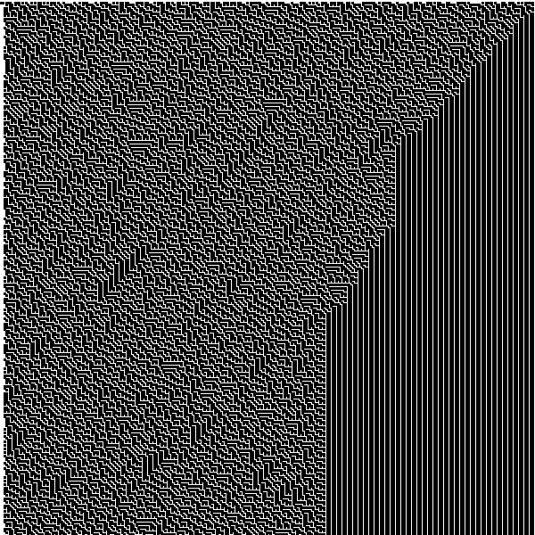

# Rule-Generator

This is a fully-functioning generator for any [Elementary Cellular Automation](https://en.wikipedia.org/wiki/Elementary_cellular_automaton).
Below the 'How to use' section are some pictures of mine and my wife's favorite ones.

### How to use
At the top of the main file, [Rule_Gen.pde](Rule_Gen.pde), there is this code:
```processing
public static int RULE = 26;
public static int SCALE = 2;
public static int POWER = 3; // Should be an odd number
```
Here is what each thing does:
* `RULE`: The rule number you want to use in base 10. Currently, the code will draw a rule, increment `RULE` by 1, then do it again. It's mezmorizing to watch, really.
* `SCALE`: The scale of the generated picture. 2 is good but 1 will make more thin lines on some, which looks neat.
* `POWER`: The number of bits that are used to calculate the next row's value. Since power = 3 by default, this allows for 8 possible configurations, meaning the max rule is 255. Increasing to 5 allows for 31 possible configurations, making the max rule 2,147 483,647. Have fun.

<h3 align='center'>Rule 151</h3>
<p align='center'></p>

<h3 align='center'>Rule 150</h3>
<p align='center'></p>

<h3 align='center'>Rule 184</h3>
<p align='center'></p>

<h3 align='center'>Rule 153</h3>
<p align='center'></p>

<h3 align='center'>Rule 54</h3>
<p align='center'></p>

<h3 align='center'>Rule 225</h3>
<p align='center'></p>

<h3 align='center'>Rule 183</h3>
<p align='center'></p>

<h3 align='center'>Rule 18</h3>
<p align='center'></p>

<h3 align='center'>Rule 106</h3>
<p align='center'></p>

<h3 align='center'>Rule 110</h3>
<p align='center'></p>

<h3 align='center'>Rule 105</h3>
<p align='center'></p>

<h3 align='center'>Rule 101</h3>
<p align='center'></p>

<h3 align='center'>Rule 129</h3>
<p align='center'></p>

<h3 align='center'>Rule 165</h3>
<p align='center'></p>

<h3 align='center'>Rule 89</h3>
<p align='center'></p>

<h3 align='center'>Rule 210</h3>
<p align='center'></p>

<h3 align='center'>Rule 99</h3>
<p align='center'></p>

